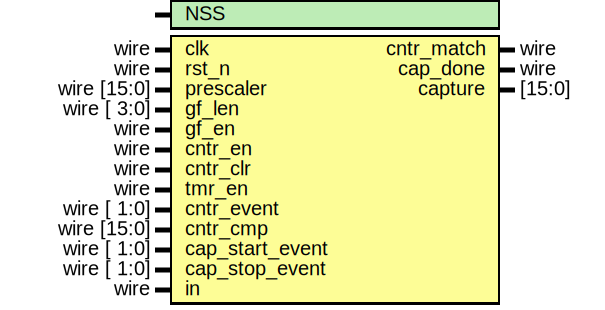

# AUCOHL_CCC16

A 16-bit Counter, Capture and Compare peripheral with the following features:
- A 16-bit counter capable of counting evenets on an external pin.
  - Rising Edge
  - Falling Edge
  - Both Edges
- A 16-bit compare register to generate an interrupt on matching the counter
- A 16 bit timer with a 16-bit prescaler for measuring the time between events.
- A synchronizer and a configurable Glitch filter.

## The Unwrapped IP Interface



### Parmeters

| Parameter name | Value | Description |
| ------------ |  ----- | ----------- |
| NSS          |  2     | Input synchronizer number of stages |

### Ports

| Port name       | Direction | Type        | Description |
| --------------- | --------- | ----------- | ----------- |
| clk             | input     | wire        |             |
| rst_n           | input     | wire        |             |
| prescaler       | input     | wire [15:0] |             |
| gf_len          | input     | wire [ 3:0] |             |
| gf_en           | input     | wire        |             |
| cntr_en         | input     | wire        |             |
| cntr_clr        | input     | wire        |             |
| tmr_en          | input     | wire        |             |
| cntr_event      | input     | wire [ 1:0] |             |
| cntr_cmp        | input     | wire [15:0] |             |
| cap_start_event | input     | wire [ 1:0] |             |
| cap_stop_event  | input     | wire [ 1:0] |             |
| cntr_match      | output    | wire        |             |
| cap_done        | output    | wire        |             |
| capture         | output    | [15:0]      |             |
| in              | input     | wire        | The input; connect to an input I/O pad |

## The wrapped IP

An APB wrapper, generated by the [IP_Utilities](https://github.com/shalan/IP_Utilities) `amba_wrap.py` utility, is provided. Other wrappers, AHB-Lite and WB, will be provided soon. All wrappers provide the same programmer's interface as outlined in the following sections.

### Wrapped IP System Integration

Based on your use case, use one of the provided wrappers or create a wrapper for your system bus type. For an example of how to integrate the APB wrapper:
```verilog
AUCOHL_CCC16_APB CCC0 (
		`TB_APB_SLAVE_CONN,
		.ext_in(ext_in)
);
```
The port `ext_in` must be connected to an input I/O pad.

> **_NOTE:_** `TB_APB_SLAVE_CONN is a convenient macro provided by [IP_Utilities](https://github.com/shalan/IP_Utilities).

### Registers

|Name|Offset|Reset Value|Access Mode|Description|
|---|---|---|---|---|
|PR|0000|0x00000000|w|The prescaler. The timer counts frequency is $clk freq/(PR+1)$|
|CCMP|0004|0x00000000|w|Counter Compare Register. The event counter is continuously compared to CCMP.|
|CAP|0008|0x00000000|r|The captured value.|
|CTRL|000c|0x00000000|w|Control Register.|
|CFG|0010|0x00000000|w|Configuration Register.|
|IM|0f00|0x00000000|w|Interrupt Mask Register; write 1/0 to enable/disable interrupts; check the interrupt flags table for more details|
|RIS|0f08|0x00000000|w|Raw Interrupt Status; reflects the current interrupts status;check the interrupt flags table for more details|
|MIS|0f04|0x00000000|w|Masked Interrupt Status; On a read, this register gives the current masked status value of the corresponding interrupt. A write has no effect; check the interrupt flags table for more details|
|IC|0f0c|0x00000000|w|Interrupt Clear Register; On a write of 1, the corresponding interrupt (both raw interrupt and masked interrupt, if enabled) is cleared; check the interrupt flags table for more details|

### PR Register [Offset: 0x0, mode: w]

The prescaler. The timer counts frequency is $clk freq/(PR+1)$


### CCMP Register [Offset: 0x4, mode: w]

Counter Compare Register. The event counter is continuously compared to CCMP.


### CAP Register [Offset: 0x8, mode: r]

The captured value.


### CTRL Register [Offset: 0xc, mode: w]

Control Register.


|bit|field name|width|description|
|---|---|---|---|
|0|TE|1|Timer enable|
|1|CE|1|Counter enable|
|2|GFE|1|Glitch Filter enable|
|3|CCLR|1|Counter Clear.|


### CFG Register [Offset: 0x10, mode: w]

Configuration Register.


|bit|field name|width|description|
|---|---|---|---|
|0|GFL|4|Glitch Filter Length (4-8).|
|4|CE|2|Counting Event; 01: Negative Edge, 10: Positive Edge, 11: Both Edges.|
|6|CAPS|2|Event to start capturing; 01: Negative Edge, 10: Positive Edge, 11: Both Edges.|
|8|CAPE|2|Event to stop capturing; 01: Negative Edge, 10: Positive Edge, 11: Both Edges.|


### Interrupt Flags

The wrapped IP provides four registers to deal with interrupts: IM, RIS, MIS and IC. These registers exist for all wrapper types generated by the [IP_Utilities](https://github.com/shalan/IP_Utilities) `amba_wrap.py` utility. Each register has a group of bits for the interrupt sources/flags. 

- IM is used to enable/disable inetrrupt sources
- RIS has the current interrupt status (interruot flags) whether they are enabled or diabled.
- MIS is the result of masking (ANDing) RIS by IM.
- IC is used to clear an inetrrupt flag. 

The following are the bit definitions for the interrupt registers:

|Bit|Flag|Width|Description|
|---|---|---|---|
|0|CM|1|Counter match.|
|1|CAP|1|Capture is done.|
